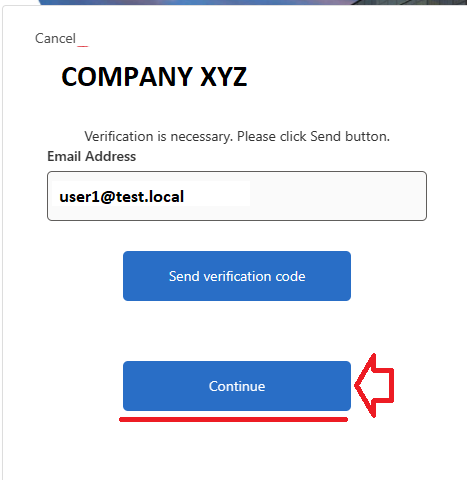
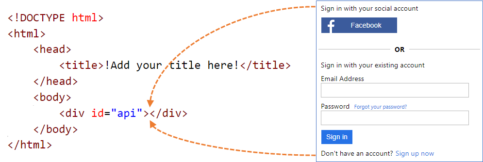
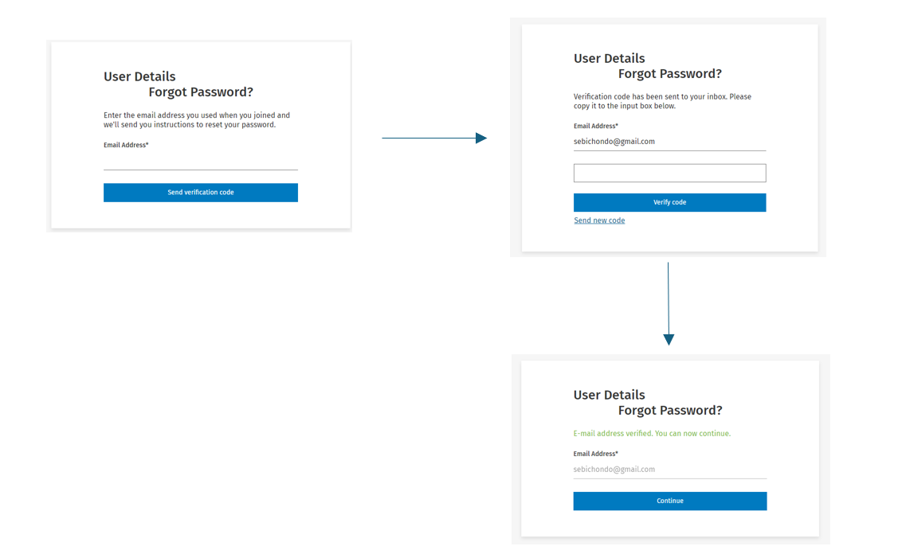

# Custom email verification - DisplayControls

The set of policies that demonstrates how to use a Custom email verification solution is well documented here:
https://github.com/azure-ad-b2c/samples/tree/master/policies/custom-email-verifcation-displaycontrol. These allow you to send your own custom email verification during sign-up or during the password reset user journeys.

However, I did run into an issue when trying to disable the **Continue** button while the e-mail verification code had not been clicked on the **Send Verification Code** button



To fix this, I used a simple JQuery solution:

```csharp
$("#continue").hide();
var observer = new MutationObserver(function (mutations) {
    mutations.forEach(function (mutationRecord) {
        $("#continue").show();
    });
});
var target = document.getElementById('email_success');
observer.observe(target, { attributes: true, attributeFilter: ['style'] });
```

What this is doing:

1. First, it's hiding the Continue button.
2. Then, it's using Javascript's MutationObserver to observe when the style attribute of div tag for the email_success label change. This will only change once a user has successfully verified their email with the emailed code.
3. Reveal the Continue button.

The email_success div tag is the ID of the div tag for a successfully verified code label. This changes based on the outclaim name in your b2c policy. So in the case of the Self Service Password Reset (SSPR) flow, the code would have been:

```csharp
$("#continue").hide();
var observer = new MutationObserver(function (mutations) {
    mutations.forEach(function (mutationRecord) {
        $("#continue").show();
    });
});
var target = document.getElementById('readOnlyEmail_success');
observer.observe(target, { attributes: true, attributeFilter: ['style'] });
```

## Custom HTML and CSS overview

Azure AD B2C runs code in your customer's browser by using Cross-Origin Resource Sharing (CORS). At runtime, content is loaded from a URL you specify in your user flow or custom policy. Each page in the user experience loads its content from the URL you specify for that page. After content is loaded from your URL, it's merged with an HTML fragment inserted by Azure AD B2C, and then the page is displayed to your customer. I was able to resolve the issue by adding the above code in a <Script> tag at the bottom of my HTML pages.



## Running the application

When you run the application, you'll be able to reset the your password by entering the email of a user. When you click on verify code, the app sends a verification code to the email account you specified. You will then be able to continue the flow once you enter the verification code:


